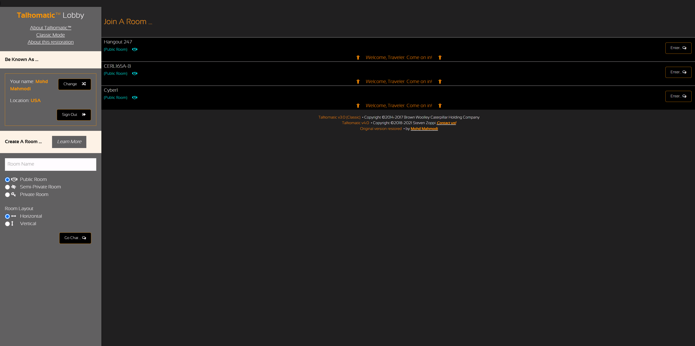
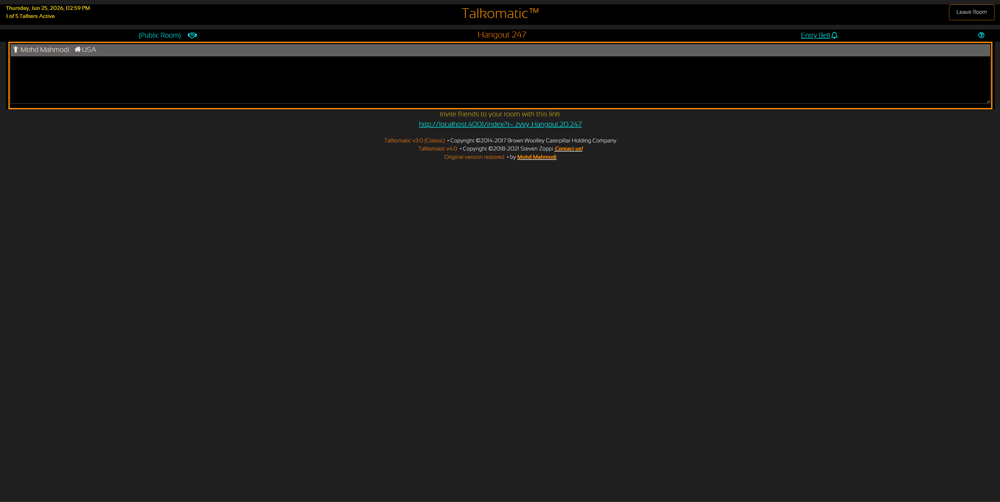
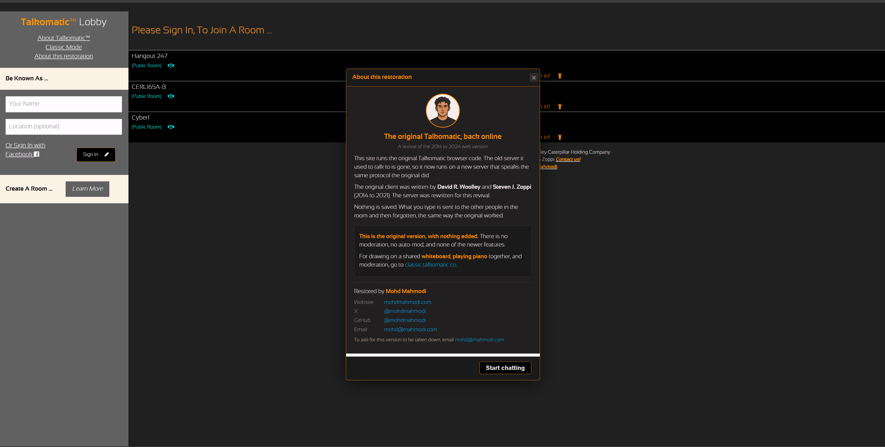

# OG Talkomatic

The original web Talkomatic from 2014 to 2024, running again.

Talkomatic was the first multi-user chat room. Doug Brown and David R. Woolley
built it on the PLATO system in 1973. Woolley later brought it to the web, and
Steven J. Zoppi kept it running through 2021. The site eventually went offline
and was saved on the Internet Archive. This repo gets it working again: the
original browser code, plus a new server that speaks the same protocol the old
one did.

You type, and other people in the room see it letter by letter as you go.
Everyone has their own area of the screen. Nothing is saved.



## Run it locally

You need [Node.js](https://nodejs.org/) 16 or newer.

```bash
git clone https://github.com/mohdmahmodi/og-talkomatic.git
cd og-talkomatic/server
npm install
npm start
```

Open http://localhost:4001 in your browser. That is the whole setup. The server
serves the pages and runs the chat. There is no database and no build step.

On Windows you can double-click `server/START.bat` instead. On macOS or Linux
you can run `bash server/START.sh`.

### Use a different port

The server uses port 4001 by default. To change it:

```bash
PORT=8080 npm start          # with an environment variable
node server.js --port 8080   # or with a flag
```

The pages use relative URLs, so any port works.

## What it looks like

A room holds up to five people, each with their own text area:



A card explains the restoration and credits, and links to the maintained version
for the newer features:



## Features

- Real-time chat, character by character, the way the original worked.
- Up to five people per room.
- Three kinds of rooms:
  - **Public**: anyone can join, and the lobby shows who is inside.
  - **Private**: protected by a key. The people inside stay hidden until you
    have the key.
  - **Semi-private**: shown in the lobby, but the host approves each person
    through a knock prompt.
- Two interfaces, both included:
  - **Classic**: the original PLATO-style look (`lobby.html`, `talko.html`).
  - **New**: Zoppi's v4 layout with a sidebar and thumbs up/down moderation
    (`lobby_en.html`, `talko_en.html`). This is the default.
- Invite links that take someone straight into a room.
- An entry bell, a "lost connection" notice, and a live count of who is talking.

## How it works

The browser opens a [Socket.IO](https://socket.io/) connection to the server and
sends short, pipe-delimited messages. The lobby asks the server for the current
room list over HTTP at `/roominfo.json`. The server keeps all state in memory and
forgets chat text as soon as it passes it on.

```
Client to server
  E|name|location|auth|link|room|userId|privacy|key|specs   enter a room
  U|deleteChars|changeIndex|newText                         edit your text
  A|text                                                    send your full text
  X                                                         leave the room
  P                                                         heartbeat
  V|direction|slot                                          vote up or down (+/-)
  K|direction|name|location                                 host grants/denies

Server to client
  W|slot                       you got this slot
  W|full | W|key | W|dup       entry refused (full, wrong key, duplicate)
  R|hostSlot|privacy           room info, sent right after you enter
  E|slot|name|loc|auth|link    someone entered
  U|slot|del|index|text        someone edited their text
  A|slot|name|loc|auth|link|text   full snapshot of someone
  X|slot                       someone left
  P                            heartbeat reply
  Z                            go back to the lobby (kicked or expelled)
  K|hostSlot|name|loc          people waiting to join (for a host)
```

The full protocol, including the privacy rules and the security limits, is in
[`server/README.md`](server/README.md).

## Project layout

```
index.html          Entry point. Handles invite links and sends you to the lobby.
go.html             "Skip this room" helper used by the lobby.
lobby.html          Classic lobby          lobby_en.html   New lobby
talko.html          Classic room           talko_en.html   New room
about.html          FAQ (classic)          about_en.html   FAQ (new)
footer.html         Shared footer
javascripts/        Client code (lobby, room, the about card, utilities)
stylesheets/        Themes and fonts
images/  sounds/     Icons and the entry and knock sounds
jqueryui/           Bundled jQuery UI
server/             The Node.js + Socket.IO server (see server/README.md)
docs/screenshots/   README images (replace with real screenshots)
```

## Put it online

To run this on a VPS behind nginx with a Cloudflare domain and pm2, follow
[`DEPLOY.md`](DEPLOY.md). It covers a setup where one server hosts several sites
under `/var/www`, which is how this is meant to be deployed at
`og.talkomatic.co`.

## Two versions of Talkomatic

This repo is the original, kept as it was. Nothing was added to it: no
moderation, no auto-mod, and none of the newer features.

The maintained version, with a shared whiteboard, piano, and moderation, is at
[classic.talkomatic.co](https://classic.talkomatic.co). This original version is
meant to go online at `og.talkomatic.co`.

## Credits

- **Doug Brown** and **David R. Woolley** for the original Talkomatic on PLATO
  (1973) and the web client. Copyright 2014 to 2017 Thinkofit, Inc.
- **Steven J. Zoppi** for the v4 client and hosting. Copyright 2018 to 2021.
- Restored by [Mohd Mahmodi](https://mohdmahmodi.com)
  ([@mohdmahmodi](https://x.com/mohdmahmodi)).

The original client code keeps its original copyright. The server in `server/`
is MIT licensed.
